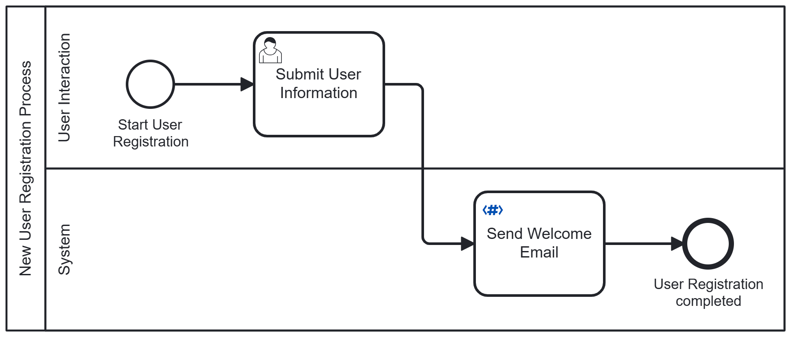

# Acheron FreeMarker Email Connector  

The **Acheron FreeMarker Email Connector** is a custom Camunda outbound connector that integrates seamlessly with FreeMarker templates to dynamically generate and send emails. This solution empowers businesses to automate their email operations, personalize communications, and ensure timely delivery of messages with minimal configuration effort.  

---

## Key Features  

- **Dynamic Email Content:** Use FreeMarker templates to craft email content dynamically based on provided data.  
- **Seamless Integration:** Fully compatible with Camunda 8.6.5 and self-managed environments.  
- **Customizable Email Fields:** Support for Sender Name, Receiver Emails, CC/BCC, Subject, and dynamic content.  
- **Extensible Design:** Easily configurable for additional email providers or customization.  

---

## Configuration  

### Environment Setup  
Before using the connector, configure the following environment variables with your email service provider's credentials and SMTP server details:  

```plaintext  
EMAIL_USERNAME = <your-email-username>  
EMAIL_PASSWORD = <your-email-password>  
EMAIL_HOST = smtp.example.com  
EMAIL_PORT = 587  
```
Ensure the SMTP server is accessible, and the credentials provided have permission to send emails.

### Building the Connector 
<li> Generate the jar file :

 &emsp;&emsp;&emsp;Navigate to the root directory of the project and run the following Maven command:

```
mvn clean package
```

 &emsp;&emsp;&emsp;This will compile the project and package it into a JAR file with all necessary dependencies.
 
<li>Build a docker image :

 &emsp;&emsp;&emsp;Once the JAR file is ready, use the following command to create a Docker image for the connector:

```
docker build -t freemarker-connector .
```

<li> Dockerfile :

 &emsp;&emsp;&emsp;Here’s the Dockerfile used to build the runtime image:

```
FROM camunda/connectors:8.6.4
COPY target/freemarker-connector-0.0.1-SNAPSHOT-jar-with-dependencies.jar /opt/app/
ENTRYPOINT ["/start.sh"]
```

<li>Build a docker runtime

  &emsp;&emsp;&emsp;Configure your runtime as per your installation from <a href="https://docs.camunda.io/docs/self-managed/connectors-deployment/connectors-configuration/">here</a> and start a container of the built docker image.

## Operation
&emsp;&emsp;&emsp;The operation of this connector utilizes FreeMarker templates to generate email content and sends it to recipients.

| Input Fields    | Description                                             |
| --------------- | ------------------------------------------------------- |
| Sender Name     | Display name of the sender                              |
| Receiver Emails | List of recipient email addresses                       |
| CC/BCC          | Optional fields for the list of CC/BCC recipients       |
| Subject         | The subject of the email                                |
| Template Path   | Path to the FreeMarker template file                    |
| Dynamic Data    | Key-value pairs for the dynamic content in the template |

## Example FreeMarker Template

```html
<html>  
  <body>  
    <h1>Hello, ${name}!</h1>  
    <p>Thank you for using our services. Your request has been processed.</p>  
  </body>  
</html>  
```

## Example API Body

```json
{  
  "senderName": "Acheron Team",  
  "receiverEmail": ["recipient1@example.com","recipient2@example.com"],  
  "templatePath": "/path/to/template.ftl",  
  "dynamicData": {  
    "name": "John Doe"  
  },
  "subject":"The subject goes here",
  "cc": ["recipient3@example.com","recipient4@example.com"],
  "bcc": ["recipient5@example.com","recipient6@example.com"]  
}  
```

### Sample BPMN

 &emsp;&emsp;&emsp;You can integrate the connector in a BPMN workflow. A sample BPMN file is shown below:<br/><br/>
<br/><br/>
&emsp;&emsp;&emsp;The connector element template that should be used for this connector can be found as a JSON file in the "element-templates" folder.

### Contact Information
For any queries and further support, please drop us a mail at camunda.support@acheron-tech.com
